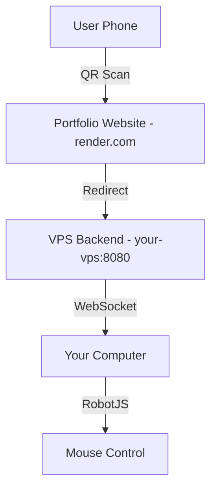

# 🚀 Remote Control Backend Deployment Plan

## 📋 Current Structure
```
Frontend (render.com) → Backend (VPS) → Your Computer
    ↓                      ↓               ↓
Portfolio Website    Remote Control    Mouse Control
```

## 🌟 Best Solution: VPS Backend

### 1. **VPS Setup** (DigitalOcean/AWS)
```bash
# VPS-ზე
git clone <your-repo>
cd 3d-portfolio
npm install
npm install -g pm2

# Start backend service
pm2 start server/server.js --name "remote-control"
pm2 startup
pm2 save
```

### 2. **Frontend Changes**
```typescript
// Production-ში VPS IP-ზე მიუთითება
const BACKEND_URL = process.env.NODE_ENV === 'production' 
  ? 'https://your-vps-ip:8080'  // VPS IP
  : 'http://localhost:8080';    // Local development
```

### 3. **Security Setup**
```bash
# VPS-ზე firewall
ufw allow 22    # SSH
ufw allow 8080  # Remote control
ufw enable

# SSL Certificate (Optional)
certbot --nginx -d your-domain.com
```

## 🏠 Alternative: Home Server

### Raspberry Pi Setup
```bash
# Pi-ზე
sudo apt update
sudo apt install nodejs npm
git clone <repo>
npm install
npm start

# Dynamic DNS setup
# No-IP, DuckDNS, etc.
```

## 🔧 Implementation Options

### Option A: **Separate Repository**
```
portfolio-frontend/     (render.com)
├── src/
├── components/
└── RemoteControl.tsx

remote-control-backend/ (VPS)
├── server/
├── public/
└── package.json
```

### Option B: **Same Repository, Split Deployment**
```bash
# Frontend deploy (render.com)
npm run build

# Backend deploy (VPS)
cd server/
node server.js
```

## 💰 Cost Comparison

| Service | Cost/Month | Pros | Cons |
|---------|------------|------|------|
| DigitalOcean | $6 | Reliable, Easy | Monthly cost |
| AWS EC2 | $3-10 | Scalable | Complex setup |
| Raspberry Pi | $0* | One-time cost | Home network dependency |
| ngrok | $5 | Simple tunneling | Limited bandwidth |

## 🎯 Recommended Implementation

1. **VPS Backend** (DigitalOcean $6/month)
2. **Domain/Subdomain** (remote.yoursite.com)
3. **SSL Certificate** (Let's Encrypt - Free)
4. **PM2 Process Manager** (auto-restart)

## 🔀 Architecture Flow

